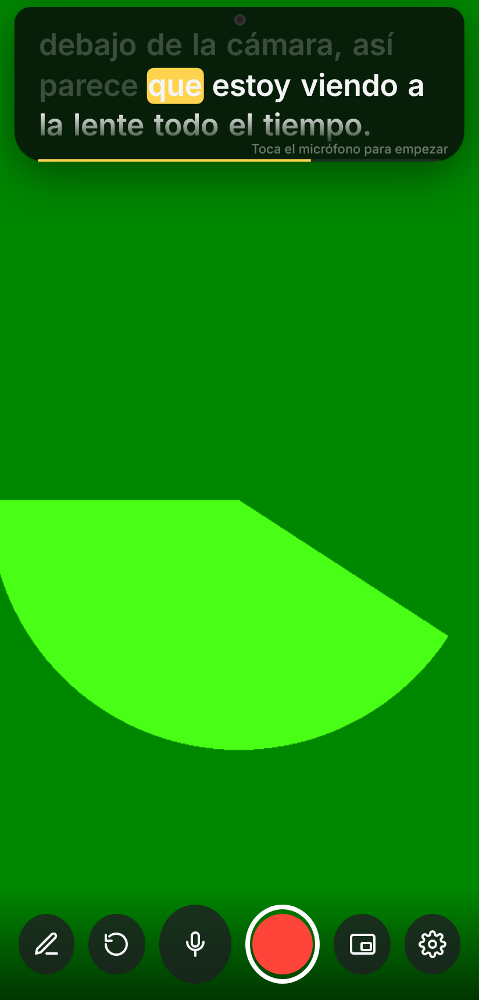
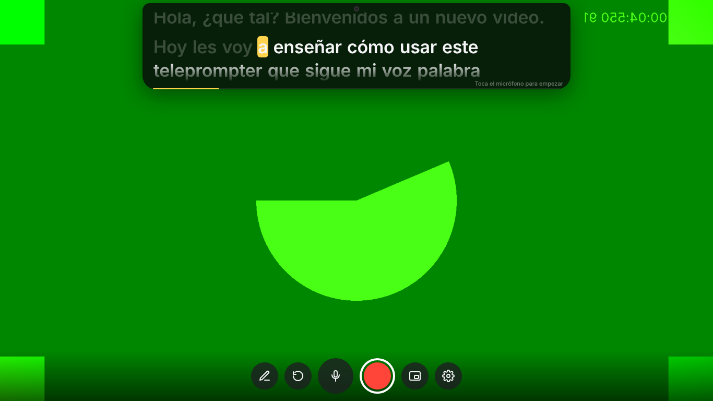

<p align="center">
  
</p>

<h1 align="center">Prompter Voz</h1>

<p align="center">
  <b>Teleprompter que sigue tu voz palabra por palabra, justo debajo de la cámara.</b><br>
  Para <b>Android</b> y <b>Windows</b>. Gratis y de código abierto.
</p>

<p align="center">
  <a href="https://j2916artprepa2a-ux.github.io/prompter-voz/"><b>▶ Abrir la app</b></a>
</p>

---

Escribe tu guion, toca el micrófono y habla. El texto se queda pegado arriba, debajo del lente, así **parece que miras a la cámara todo el tiempo**. Cada palabra que dices se ilumina y el texto avanza solo: no tienes que ajustar velocidad ni que alguien te lo mueva.

<p align="center">
  
  &nbsp;&nbsp;
  
</p>

## Funciones

- 🎙️ **Sigue tu voz palabra por palabra**: resalta la palabra que te toca decir y avanza mientras hablas.
- 🔁 **Te alcanza si te saltas algo**: si brincas una frase, se ubica solo. Si repites palabras o hay ruido, no se mueve de más.
- 📷 **Texto debajo de la cámara**: panel tipo *notch* arriba de la pantalla, pegado al lente frontal.
- ⏺️ **Graba video con audio** desde la app y lo guarda (en Android lo puedes compartir directo).
- 🪟 **Ventana flotante en Windows**: el texto queda **siempre encima** de cualquier app (Zoom, OBS, Cámara de Windows, Meet…). Arrástrala debajo de tu webcam.
- 👆 Toca cualquier palabra para saltar ahí o arrastra el texto con el dedo.
- 🔤 Tamaño de letra, líneas visibles, idioma de voz y modo espejo para cristal de teleprompter.
- ⌨️ Atajos en la compu: `Espacio` pausa/sigue · `↑ ↓ ← →` mueven · `R` reinicia.
- 📲 Se instala como app (PWA) y recuerda tu último guion.

## Instalar

### Android
1. Abre **https://j2916artprepa2a-ux.github.io/prompter-voz/** en **Chrome**.
2. Menú `⋮` → **Instalar app** (o "Agregar a pantalla principal").
3. Acepta los permisos de **cámara** y **micrófono**.

### Windows
1. Abre el link en **Chrome** o **Edge**.
2. Haz clic en el ícono de **instalar** en la barra de direcciones.
3. Para usarlo encima de otra app, toca el botón de **ventana flotante** y pon la ventanita justo debajo de tu webcam.

## Cómo funciona

- El reconocimiento de voz usa la **Web Speech API** del navegador (Chrome/Edge), en español de México por defecto.
- Cada vez que dices algo, la app toma tus últimas palabras y las **alinea con el guion** cerca de donde vas. Acepta errores pequeños de pronunciación y saltos hacia adelante, y solo regresa si está muy seguro.
- Todo corre en tu dispositivo. El guion se guarda en tu navegador, no en un servidor.

## Requisitos y limitaciones

- Necesita **internet** para el reconocimiento de voz.
- Necesita **HTTPS** para cámara y micrófono (GitHub Pages ya lo da).
- En algunos Android, grabar video y seguir la voz al mismo tiempo puede chocar por el micrófono.
- En Android el texto se muestra dentro de la app; no puede ponerse encima de la app de Cámara del sistema.

## Estructura

```
index.html      # toda la app (interfaz + seguimiento de voz + cámara + grabación)
manifest.json   # datos para instalarla como app
sw.js           # funciona offline (menos el reconocimiento de voz)
icons/          # íconos
```

## Correr en local

```bash
python -m http.server 8000
# abre http://localhost:8000
```

## Créditos

Inspirado en Textream para macOS.

## Licencia

MIT © 2026 Jorge Arturo Hernández Cuéllar
